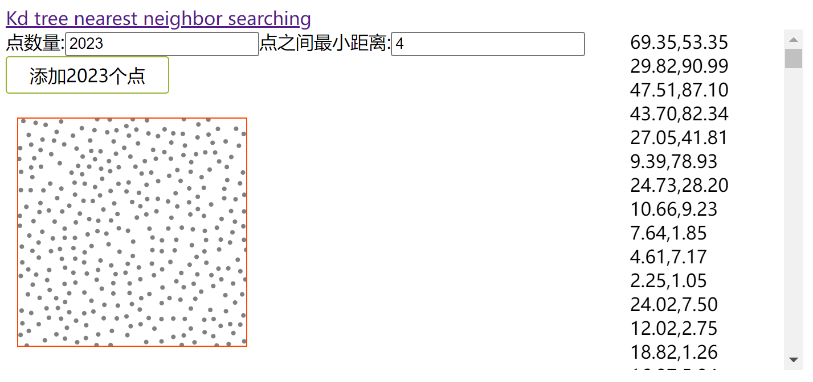

# Kd tree nearest neighbor search

Nearest neighbour search: [wiki](https://en.wikipedia.org/wiki/K-d_tree#Nearest_neighbour_search)

实现代码: [ gist ](https://gist.github.com/MXXXXXS/ccff3f159773d958442c39378c614309)

应用: [Poisson-Disc Sampling](https://www.jasondavies.com/poisson-disc/)

生成分散点, 点之间可以指定最小距离

获取 2d 平面中离将要插入的点最近的点, 如果将要插入的点离该点的距离大于指定的最小距离, 则插入该点

